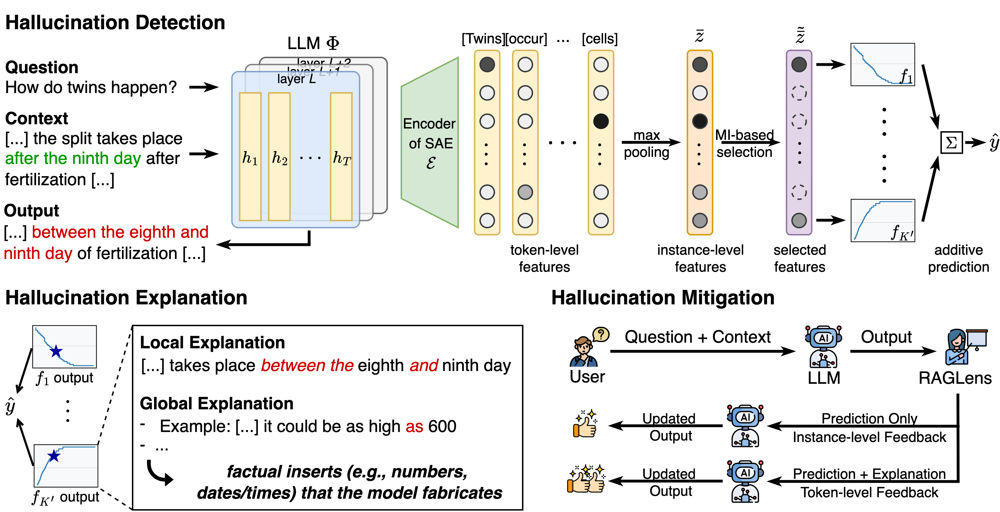

# RAGLens: Toward Faithful Retrieval-Augmented Generation with Sparse Autoencoders

## Overview

RAGLens is a lightweight hallucination detector for Retrieval‑Augmented Generation (RAG). It leverages sparse autoencoders (SAEs) to disentangle internal LLM activations and then applies a generalized additive model (GAM) over a small, information‑rich subset of features. This yields accurate faithfulness judgments and human‑readable rationales (global + token‑level), enabling practical post‑hoc mitigation.



## Requirements

Install the dependencies listed in `requirements.txt`. Dependencies of the [sparsity](https://github.com/EleutherAI/sparsify) package are required for the training/inference of SAEs.

## Quickstart

1) Data preparation

```python
import os
import sys
import torch
root_dir = './'
sys.path.append(os.path.join(root_dir, "src"))
from sparsify import Sae
from data_loading import RAGEvalDataset
from transformers import AutoModelForCausalLM, AutoTokenizer
from sklearn.metrics import balanced_accuracy_score, f1_score

train_data = RAGEvalDataset("TofuEval", "dev", root_dir = './').items
train_labels = [1 if len(item['hall_info']) > 0 else 0 for item in train_data]
test_data = RAGEvalDataset("TofuEval", "test", root_dir = './').items
test_labels = [1 if len(item['hall_info']) > 0 else 0 for item in test_data]

llm_name = "meta-llama/Llama-3.2-1B"
sae_name = "EleutherAI/sae-Llama-3.2-1B-131k"
hookpoint = "layers.6.mlp"

tokenizer = AutoTokenizer.from_pretrained(llm_name, cache_dir=os.path.join(root_dir, "../huggingface/hub"))
model = AutoModelForCausalLM.from_pretrained(llm_name, torch_dtype=torch.bfloat16, cache_dir=os.path.join(root_dir, "../huggingface/hub"), device_map="auto")
model.eval()
sae = Sae.load_from_hub(sae_name, hookpoint=hookpoint, device="cuda")
sae.cfg.transcode = True if "transcoder" in sae_name else False
sae.eval()
```

2) Initialize and fit RAGLens
```python
from RAGLens import RAGLens

raglens = RAGLens(tokenizer=tokenizer, model=model, sae=sae, hookpoint=hookpoint)

raglens.fit(
    inputs = [item['input'] for item in train_data],
    outputs = [item['output'] for item in train_data],
    labels = train_labels,
)
```

3) Predict and evaluate
```python
preds = raglens.predict(
    inputs = [item['input'] for item in test_data],
    outputs = [item['output'] for item in test_data],
)
print(f"Balanced Accuracy: {balanced_accuracy_score(test_labels, preds)}") # 0.6865
print(f"Macro F1: {f1_score(test_labels, preds, average='macro')}") # 0.6876
```

## Citation
For the use of `RAGLens`, please consider citing
```bibtex
@inproceedings{
    xiong2026toward,
    title={Toward Faithful Retrieval-Augmented Generation with Sparse Autoencoders},
    author={Guangzhi Xiong and Zhenghao He and Bohan Liu and Sanchit Sinha and Aidong Zhang},
    booktitle={The Fourteenth International Conference on Learning Representations},
    year={2026},
    url={https://openreview.net/forum?id=hgBZP67BkP}
}
```
